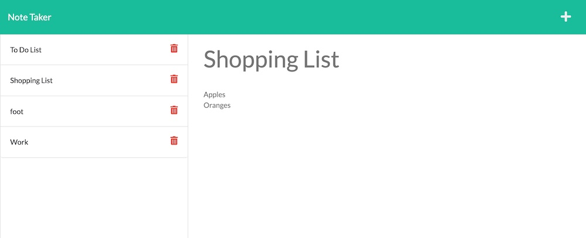

  
  
  # Note Taker
  ## Description
  Project demonstrating simple Full Stack functionality deployed to a live server.  This project uses NodeJs and Express to create a back end server while pulling information with API functionality to utilize Get, Post, and Delete requests.
  
  ## Table of Contents
  - [Installation](#installation)
  - [Usage](#usage)
  - [Contributing](#contributing)
  - [License](#license)
  - [Screenshot](#screenshot)
  - [Questions](#questions)
  ## Installation
  npm i
  ## Usage
  node index.js

  ## Testing
  No Testing Set up
  ## Contributing
  Open Source
  
  
  ## License
  This project is protected under MIT License.

[License Documentation](https://opensource.org/licenses/MIT)

  ## Screenshot
  

  [Link to Live Project](https://troy-allen-note-taker.herokuapp.com/)

  [link to GitHub Repo](https://github.com/tallen1985/11-Homework-Note-Taker)
  ## Questions
  [Refer to Github Profile: tallen1985](http://www.github.com/tallen1985)
  
  Any additional questions, reach me at my email jake.allen@me.com

  